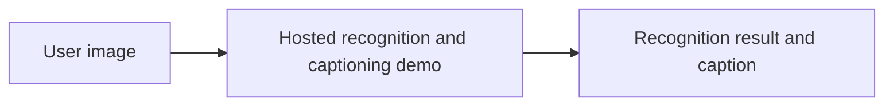

# Image Recognition and Auto-Captioning API

<strong>A computer-vision API showcase for image recognition and automatic caption generation.</strong>

## Links

- [Hosted app](https://vision-caption-api.vercel.app/)
- [API documentation](https://vision-caption-api.vercel.app/api/docs)
- [Results view](https://vision-caption-api.vercel.app/api/results)
- [Logs view](https://vision-caption-api.vercel.app/logs)

Hosting or endpoint availability can change. These links were retained from the repository's existing project notes.

## Project overview

The repository contains presentation images and project metadata, but not the API implementation or dependency/configuration files. The flow below is the intended user journey, not a verified internal architecture.

## Media

## Reproduce locally

The source code is not included, so this repository currently cannot be installed or run locally. Add the API/UI source, model/provider configuration, and setup steps to make the project maintainable from GitHub.
